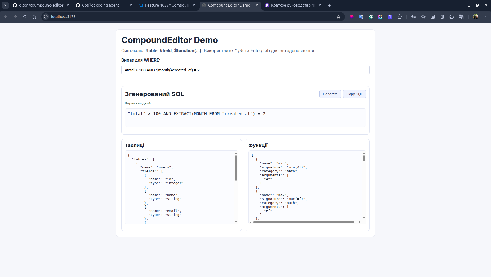

# Compound Editor



Редактор, який дозволяє користувачам вводити текст з певними правилами синтаксису для посилання на таблиці, поля та функції бази даних. Редактор підтримує різні типи сутностей, такі як таблиці, поля та функції, і дозволяє користувачам легко створювати складні запити до бази даних.

Редактор створений на базі HTMLInput і написаний на TypeScript. Він підтримує авто доповнення для таблиць, полів та функцій, а також дозволяє користувачам легко вставляти ці сутності в текст.

## Build

```bash
npm install
npm run build
```

## Start

```bash
npm run start
```

## Usage

```js
import { CompoundEditor } from './CompoundEditor';
const editor = new CompoundEditor(document.getElementById('editor') as HTMLInputElement);
editor.getResult(); // отримує згенеровану строку для використання в SQL запиті
```